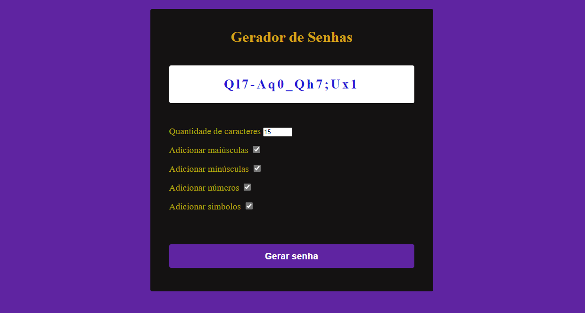

<h3 align="center">
    <b>Gerador de senhas</b>  
    <br>
</h3>


- [Sobre](#sobre)
- [Tecnologias Utilizadas](#tecnologias-utilizadas)
- [Como Usar](#como-usar)
- [Como Contribuir](#como-contribuir)

<a id="sobre"></a>


## :bookmark: Sobre

O <strong> Gerador de senhas </strong> é uma aplicação que permite gerar senhas a parti das opções que usuario selecionar, pode selecionar o quantidade caracteres, simbolos, numeros e letras maiusculas e minusculas.

Essa aplicação foi construída durante o curso <strong> JavaScript e TypeScript do Básico ao avançado </strong> distribuída por  Luiz Otávio Miranda..


<a id="tecnologias-utilizadas"></a>

## :rocket: Tecnologias Utilizadas

O projeto foi desenvolvido utilizando as seguintes tecnologias


- [HTML](https://developer.mozilla.org/pt-BR/docs/Web/HTML)
- [Javascript](https://developer.mozilla.org/pt-BR/docs/Web/javascript)
- [CSS](https://developer.mozilla.org/pt-BR/docs/Web/css)


## :heavy_check_mark: :computer: Resultado Web

<h1 align="center">
    
</h1>


<a id="como-usar"></a>

## :fire: Como usar

- ### **Pré-requisitos**

  - É **necessário** possuir o **[Live Server](https://marketplace.visualstudio.com/items?itemName=ritwickdey.LiveServer)** instalado no VScode


1. Faça um clone :

```sh
  git clone https://github.com/Rafael-Rufino/Calculadora-Simples.git
```


## :recycle: Como contribuir

- Faça um Fork desse repositório,
- Crie uma branch com a sua feature: `git checkout -b my-feature`
- Commit suas mudanças: `git commit -m 'feat: My new feature'`
- Push a sua branch: `git push origin my-feature`


<h4 align="center">
    Feito com 💜 by <a href="https://www.linkedin.com/in/rafael-r-dos-santos-b889311ba/" target="_blank">Rafael Rufino</a>
</h4>


